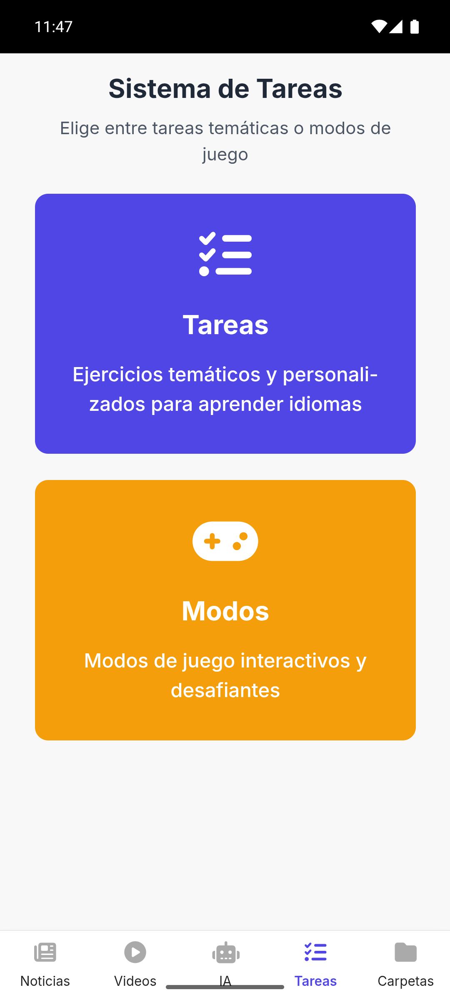
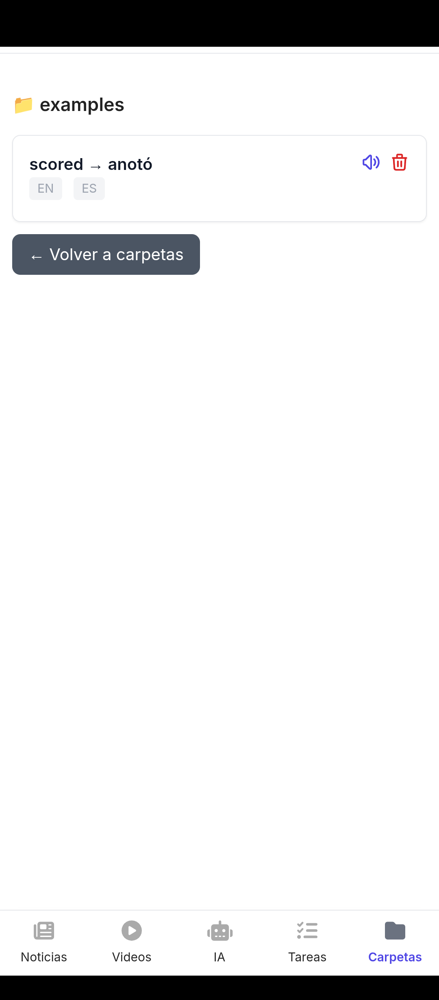
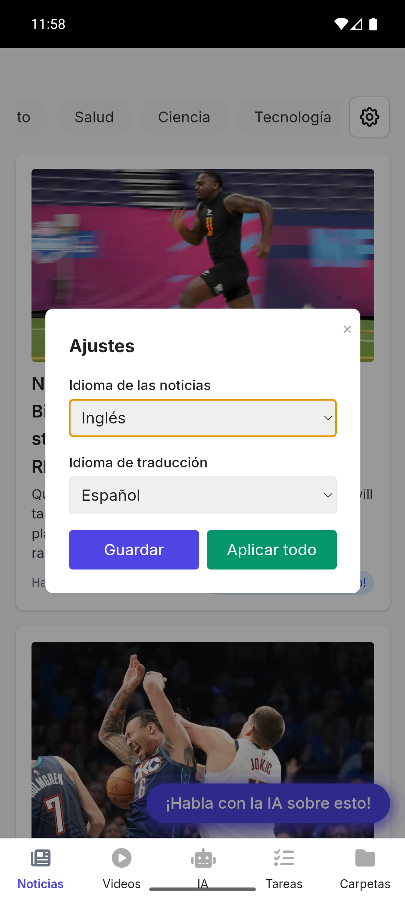

# 🐱 Siamerse 

## 🇺🇸 English

> **Learn languages by immersing yourself in your daily routine.** Stop "studying" and start "living" the language by consuming real news, competing with AI, and saving vocabulary in context.

---

## What is Siamerse?
Siamerse is born from a simple yet powerful idea: **passive immersion**. Polyglots don't learn by memorizing vocabulary lists for an hour a day; they learn by surrounding themselves with the language. 

With your feline companion (Siamerse), you can read real-world news. If you don't understand a word, just tap it to translate it instantly, save it in your customized folders, and ask the AI to explain the context.

## Key Features

* 📰 **Real-Time News:** Read articles from all over the world.
* 👆 **Smart Contextual Translation:** Tap any word in an article to get an instant translation without interrupting your reading.
* 📁 **Vocabulary Folders:** Save the words you learn to review them later (includes audio pronunciation).
* 🤖 **Integrated AI Tutor (Gemini 3):** Chat with the AI about the news you are reading. Ask for grammar explanations, vocabulary usage, or simple text summaries.
* 🎮 **Interactive Tasks:** AI-generated exercises based on your topics of interest (vocabulary, fill-in-the-blanks, grammar).
* ⚔️ **Duel Mode:** Compete against the AI to see who translates faster!
### 🌍 Supported Languages
You can fully customize your experience by selecting the language of the news you want to read and the language you want the translations in. Currently available:
> 🇺🇸 English | 🇪🇸 Spanish | 🇩🇪 German | 🇫🇷 French | 🇮🇹 Italian | 🇵🇹 Portuguese | 🇷🇺 Russian | 🇯🇵 Japanese

---

## App Preview

  
  
  
  

---

## How to install Siamerse on Android

As an independent application (not yet available on the Play Store), installation is done via the `.apk` file. It is 100% safe.

1. Go to the **[Releases](../../releases)** section on the right side of this page.
2. Download the `siamerse_v1.0.0.apk` file (or the latest available version) to your phone.
3. Open the downloaded file.
4. If your phone asks for permission to "Install unknown apps", tap **Allow**.
5. Done! Open Siamerse and start learning.

---

## 👨‍💻 Created by
**Dylan Gonzalo Ferreyra**
* [My GitHub](https://github.com/DylanGonzaloFerreyra)
* Contact: dylanferreyra006@gmail.com

## 🇪🇸 Spanish

> **Aprende idiomas sumergiéndote en tu rutina diaria.** Deja de "estudiar" y empieza a "vivir" el idioma consumiendo noticias reales, compitiendo con la IA y guardando vocabulario en contexto.

---

## ¿Qué es Siamerse?
Siamerse nace de una idea simple pero poderosa: **la inmersión pasiva**. Los políglotas no aprenden memorizando listas de vocabulario durante una hora al día; aprenden rodeándose del idioma. 

Con tu compañero felino (Siamerse), puedes leer noticias del mundo real. Si no entiendes una palabra, solo tócala para traducirla al instante, guárdala en tus carpetas personalizadas y pídele a la IA que te explique el contexto.

## Características Principales

* 📰 **Noticias en tiempo real:** Lee artículos de todo el mundo.
* 👆 **Traducción contextual inteligente:** Toca cualquier palabra en un artículo para obtener una traducción instantánea sin interrumpir tu lectura.
* 📁 **Carpetas de vocabulario:** Guarda las palabras que aprendes para repasarlas más tarde (incluye pronunciación en audio).
* 🤖 **Tutor de IA integrado (Gemini 3):** Chatea con la IA sobre las noticias que estás leyendo. Pídele explicaciones de gramática, uso de vocabulario o resúmenes de texto sencillos.
* 🎮 **Tareas interactivas:** Ejercicios generados por IA basados en tus temas de interés (vocabulario, completar espacios en blanco, gramática).
* ⚔️ **Modo Duelo:** ¡Compite contra la IA para ver quién traduce más rápido!

### 🌍 Idiomas Soportados
Puedes personalizar completamente tu experiencia seleccionando el idioma de las noticias que quieres leer y el idioma en el que quieres las traducciones. Actualmente disponibles:
> 🇺🇸 Inglés | 🇪🇸 Español | 🇩🇪 Alemán | 🇫🇷 Francés | 🇮🇹 Italiano | 🇵🇹 Portugués | 🇷🇺 Ruso | 🇯🇵 Japonés

---

## Vistazo a la App

  
  
  
  

---

## Cómo instalar Siamerse en Android

Al ser una aplicación independiente (aún no disponible en la Play Store), la instalación se realiza a través del archivo `.apk`. Es 100% segura.

1. Ve a la sección de **[Releases](../../releases)** en el lado derecho de esta página.
2. Descarga el archivo `siamerse_v1.0.0.apk` (o la última versión disponible) en tu celular.
3. Abre el archivo descargado.
4. Si tu celular te pide permiso para "Instalar aplicaciones desconocidas", toca en **Permitir**.
5. ¡Listo! Abre Siamerse y empieza a aprender.

---

## 👨‍💻 Creado por
**Dylan Gonzalo Ferreyra**
* [Mi GitHub](https://github.com/DylanGonzaloFerreyra)
* Contacto: dylanferreyra006@gmail.com
